# Urban Scooter — Web & API Testing Project

## 📌 Project Overview
QA project focused on web testing, backend validation, API testing, and bug reporting for the Urban Scooter application.

---

## 🚀 Technologies & Tools
- Manual Testing
- API Testing
- Postman
- Jira
- Chrome DevTools
- JSON
- Google Sheets
- Cross-Browser Testing
- Bug Reporting

---

## ✅ Project Scope

### Web Testing
Executed manual test cases validating:

- Name field validation
- Last name validation
- Address restrictions
- Metro station suggestions
- Phone number validation
- Delivery date calendar
- Rental period dropdown
- Color selection checkboxes
- Comment field restrictions

---

### Backend & API Testing
Performed API testing using Postman:

- POST /api/v1/courier
- DELETE /api/v1/courier/:id

Validated:
- Login creation
- Password requirements
- User deletion
- Invalid IDs
- API responses
- Backend behavior

---

## 🐞 Bug Reporting
Documented bugs and test evidence using Jira and Google Sheets.

---

## 🌐 Browsers Tested
- Google Chrome
- Opera

---

## 📂 Test Case Documentation

### Web Testing
[https://docs.google.com/spreadsheets/d/1jHCLps8j_o4k8NsVGdlrep-pzTlv39RfJ6fFiTEcVd4/edit?gid=0#gid=0]

### API Testing
[https://docs.google.com/spreadsheets/d/1jHCLps8j_o4k8NsVGdlrep-pzTlv39RfJ6fFiTEcVd4/edit?gid=46614568#gid=46614568]

## 📸 Screenshots

### Postman API Testing
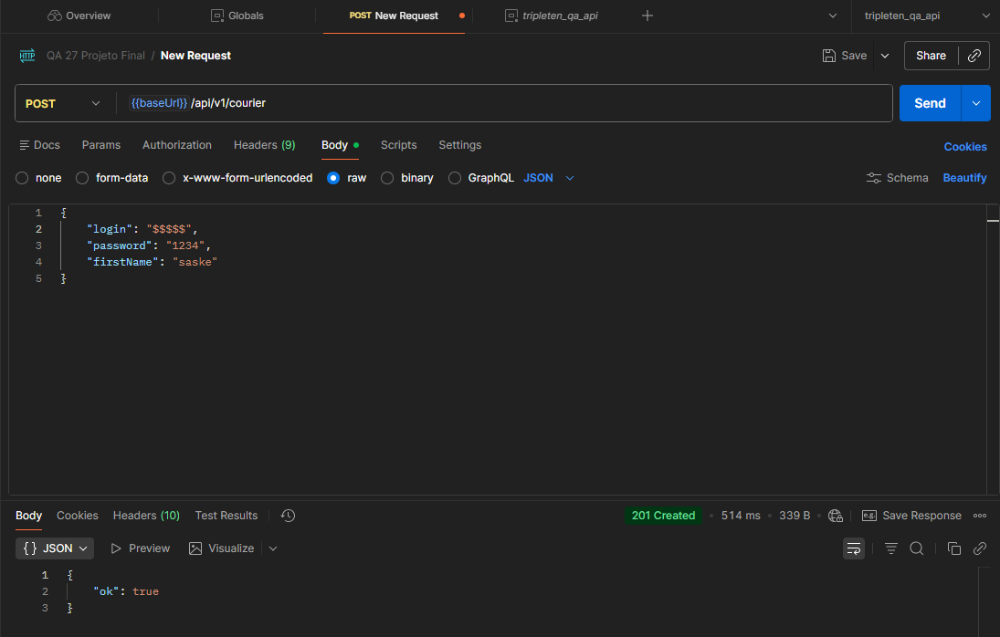
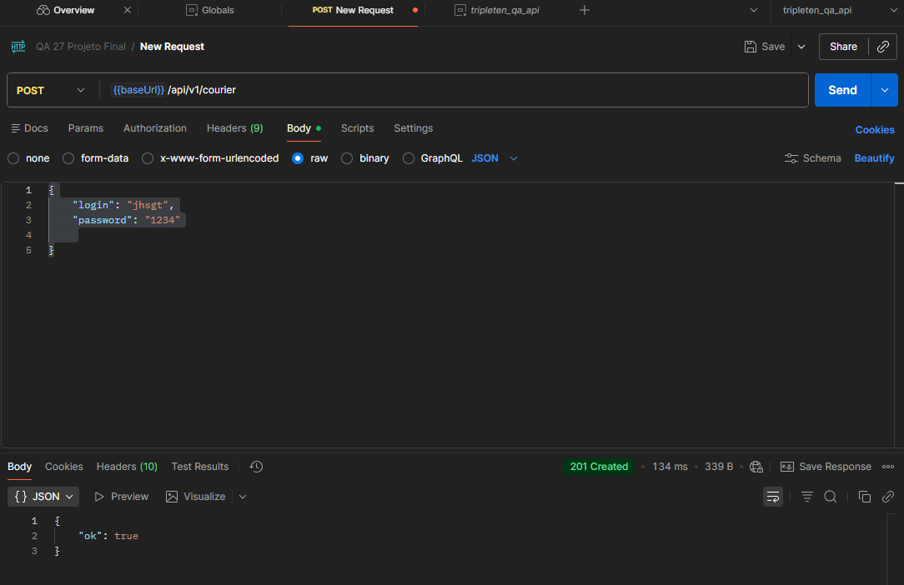
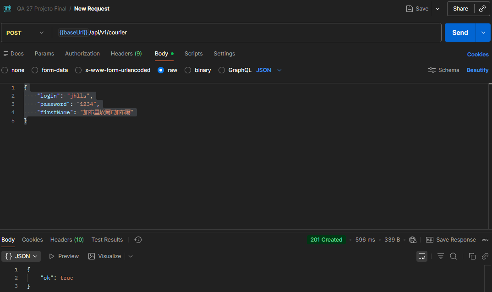
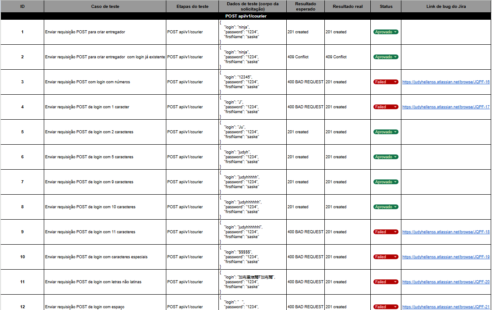
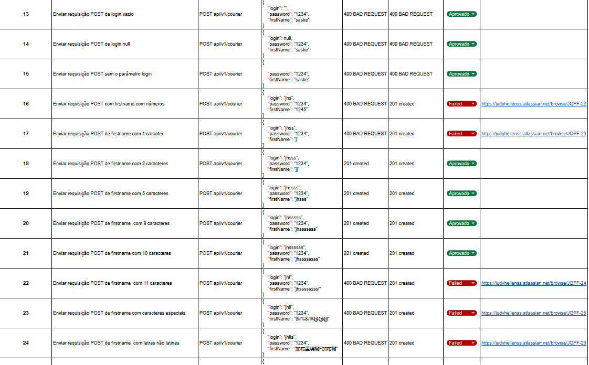
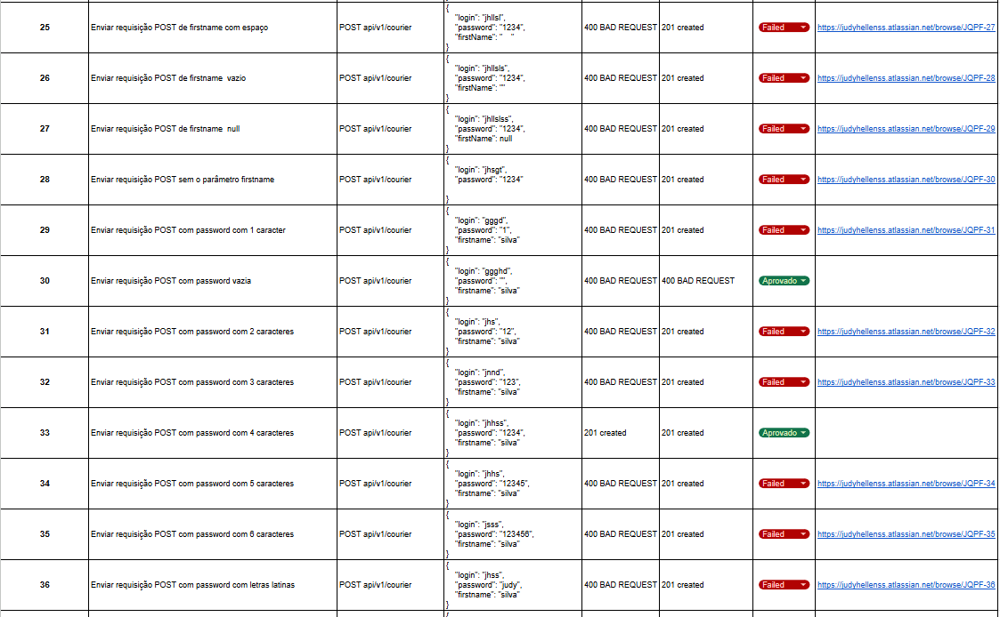
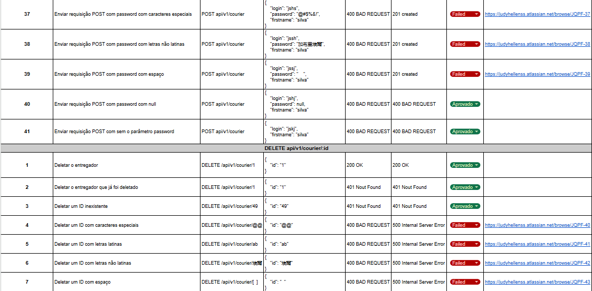

### Bug Reports
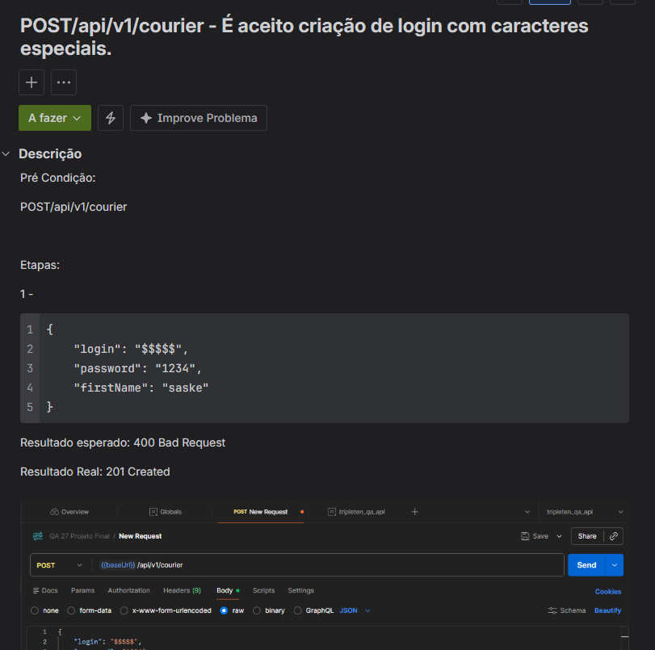
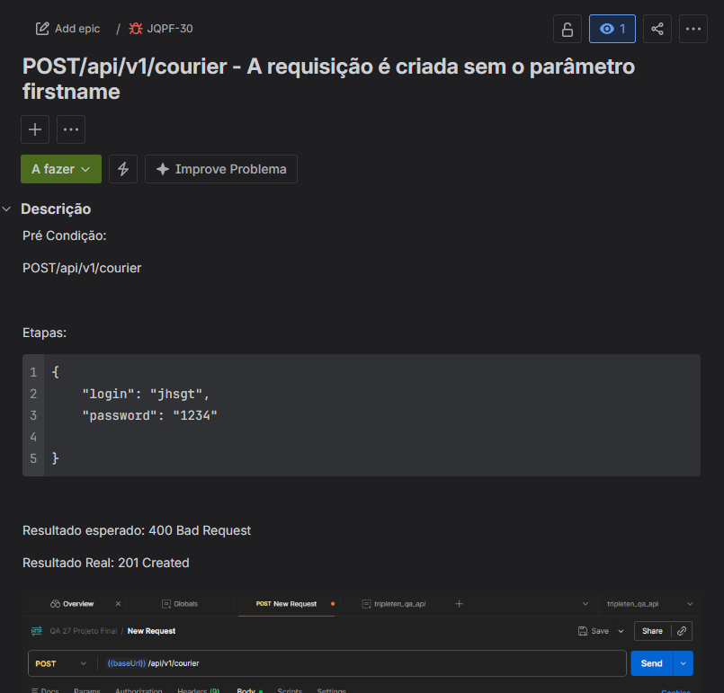
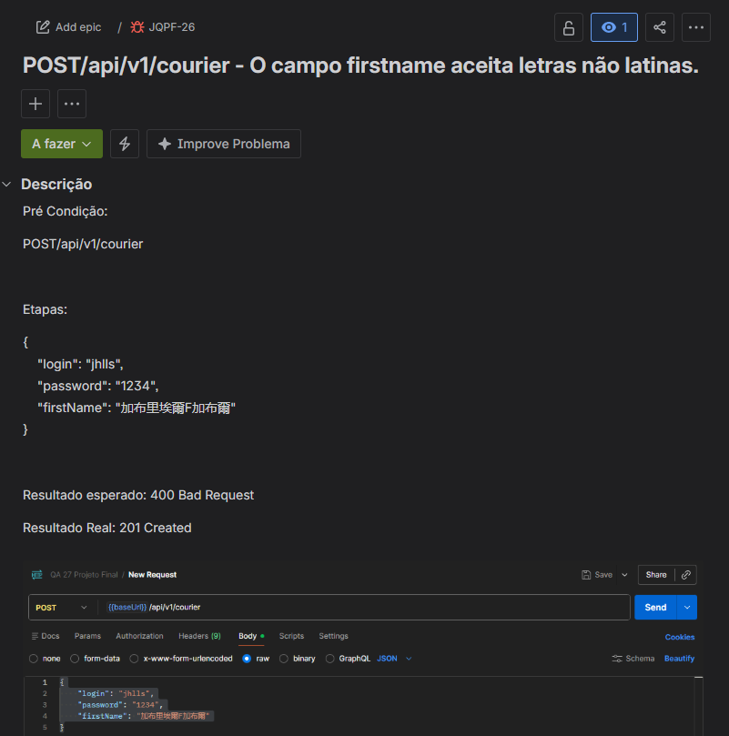
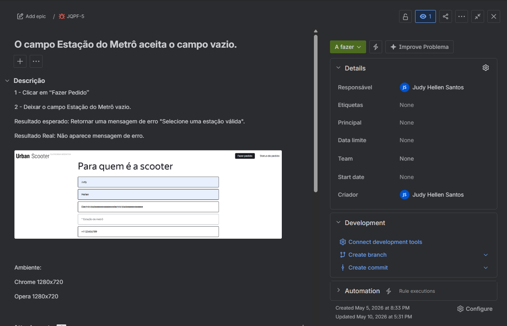

## 👩‍💻 Author
Judy Hellen Silva
QA Software Engineering
